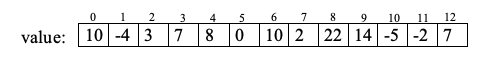
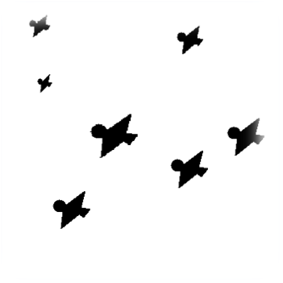

# Instructions
 Write a program that performs the following functionalities.

Your program should contain the following functions:

1.	Fibonacci: a recursive function that computes the fibonacci series. The recurrence relation is defined as the following:
```
fibonacci (n) = fibonacci(n-2) + fibonacci(n-1)
fibonacci(0) = 0
fibonacci(1) = 1
```
So the fibonacci sequence is: 0, 1, 1, 2, 3, 5, 8, 13, 21, 34 …. Therefore, fibonacci(4) = 3, fibonacci(5) = 5, fibonacci(7)=13

2. 	Sum: a recursive function that computes the sum of integers 1, 2, 3, …., n for a given number n.
So Sum(6) should return 1 + 2 + 3 + 4 + 5 + 6 , i.e. 21. The recurrence relation is defined as: sum(n) = n + sum(n-1).

3. Largest: a recursive function that computes the largest value for an integer array of positive and negative values. For example, for the array below, the function largest should return 22, which is the largest value in the array. You can assume there are no more 20 integers in the array. Think of how to formulate the recurrence relation in this problem yourself.



4. The 4th problem mimics the situation where eagles flying in the sky can be spotted and counted.
   
    	FindEagles: a recursive function that examines and counts the number of objects (eagles) in a photograph. The data is in a two-dimensional grid of cells, each of which may be empty (value 0) or filled (value 1 to 9). Maximum grid size is 50 x 50. The filled cells that are connected form an object (eagle). Two cells are connected if they are vertically, horizontally, or diagonally adjacent.  The following figure shows 3 x 4 grids with 3 eagles.
``` 
0 0 1 2
1 0 0 0
1 0 3 1
```
FindEagle function takes as parameters the 2-D array and the x-y coordinates of a cell that is a part of an eagle (non-zero value) and erases (change to 0) the image of an eagle.  The function FindEagle should return an integer value that counts how many cells has been counted as part of an eagle and have been erased.
The following sample data has two pictures, the first one is 3 x 4, and the second one is 5 x 5 grids. Note that your program should be able to handle any number of pictures that are contained in the data file.
Print out the picture of the photograph, the highest value in the photograph, and number of eagles found in each picture.  As the program discovers each eagle, it should also print the size of the eagle just found.  Process all the pictures in the file. 
```
Sample data file:
3 4
0 0 1 2
1 0 0 0
1 0 5 1
5 5
0 0 0 1 1
0 1 8 1 9
0 0 0 0 0
1 0 0 2 1
1 3 1 9 1
 
Sample output:
 
0 0 1 2 
1 0 0 0 
1 0 5 1 

An eagle size 2 is found.
An eagle size 2 is found.
An eagle size 2 is found.

3 eagle(s) found in the picture.

0 0 0 1 1 
0 1 8 1 9 
0 0 0 0 0 
1 0 0 2 1 
1 3 1 9 1 

An eagle size 6 is found.
An eagle size 8 is found.

2 eagle(s) found in the picture.
```
Requirements:
* Define a parameters.h file, which should contain the following declarations only:
```
//constant for testing with Fibonacci function
const int FibVal = 10;

//constant for testing with sum function
const int SumVal = 13;

//constant array for testing with Longest function
const int LongestVal[13] = 
{10, -4, 3, 7, 8, 0, 10, 2, 22, 14, -5, -2, 7};
```

* In the main function, call each of first 3 functions once by passing the corresponding constants defined in parameters.h, and the result should be printed with an appropriate heading.

* For the 4th problem, write a while loop to read and process each photograph in the data file one by one. 